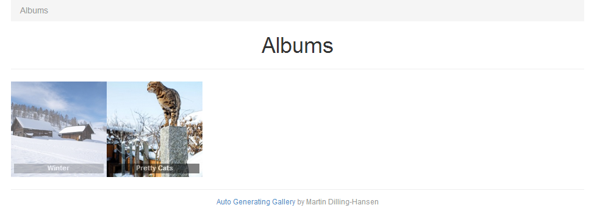
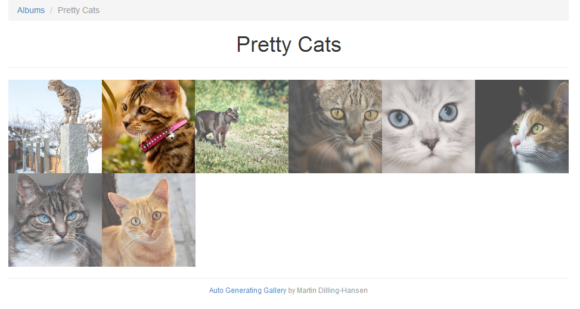
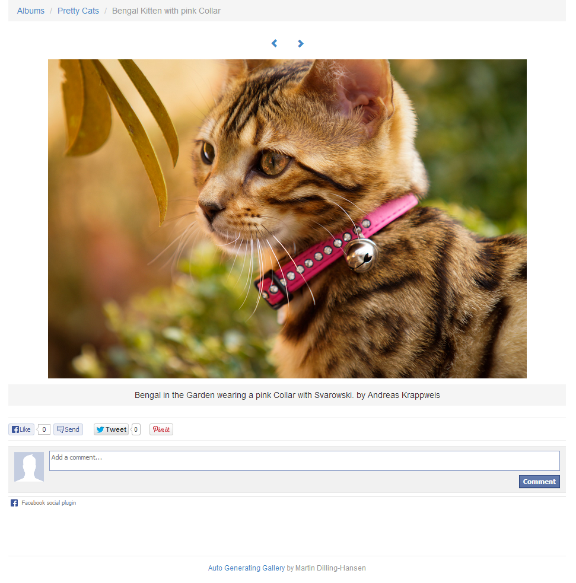
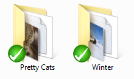
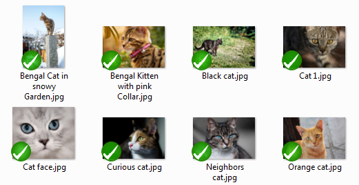
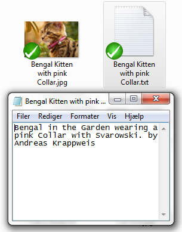
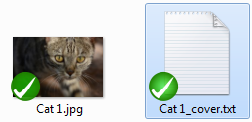
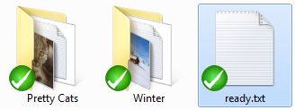

Auto Generating Gallery
=======================

[See the demo](http://gallerydemo.martindilling.com)

**Pretty, simple and easy gallery.**

1. Upload albumfolder via ftp
2. Visit domain.com/import
3. Done ;)

## Previews

### Index view

### Album view

### Image view

## Installation

Like with Laravel 4 you need to install all the nessesary packages with composer:

    composer install

Configure the database settings in *app/config/database.php*
And migrate the database with:

    artisan migrate

Change configuration of the gallery in *app/config/filegallery.php*

That should be it ;)

## Albums

Albums will be created from the folders in the 'uploads' folder.
The foldername will be used as the albumname, and the folders will be renamed to
a more webfriendly name (strip special characers and replace spaces with dashes).

## Images

Images will be created from the imagefiles in the album folders.
Don't worry about the names they will be renamed to more webfriendly names
(strip special characers and replace spaces with dashes).

## Image descriptions

To create a description for an image, create a *.txt file with the same name as
the imagefile, and write the description in that file.

## Album cover

To set an image from the album as the cover picture, create an empty *.txt file,
and name it '%imagefilename%_cover.txt'

## Ready file

To avoid starting import before you have all the files uploaded and ready,
create an empty *.txt file named 'ready.txt' to the 'uploads' folder when you
are ready to import the files.

## Starting import

To start the import, make sure you have uploaded the files and created the
ready-file. Then go to the route '/import', eg. mywebgallery.com/import.
It will be working some time depending on the size of the images you want to import ;)
